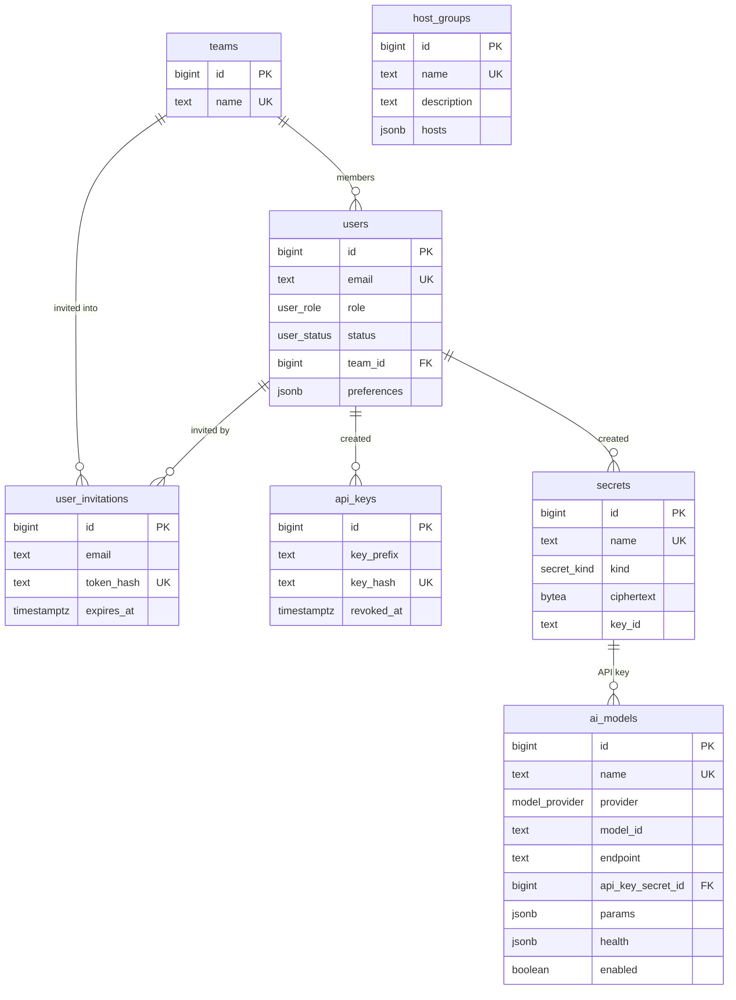
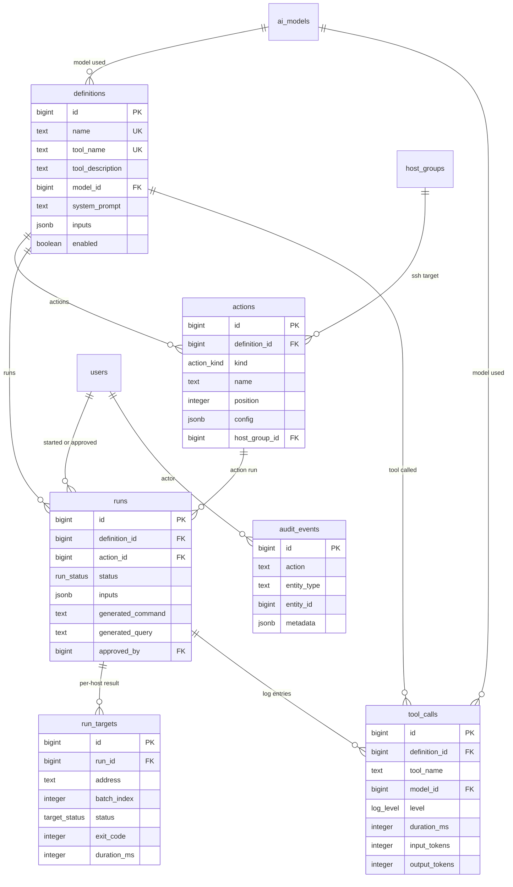

# MCP Panel — Veritabanı Şeması

Çalıştırılabilir DDL: [`schema.sql`](./schema.sql) · Liquibase changelog:
[`../db/changelog/`](../db/changelog/)

Panel tarafının dokümanı (`PANEL.md`) `mcp-panel` deposundadır.

**Hedef:** PostgreSQL 10+ (`GENERATED … AS IDENTITY` bu sürümden itibaren).
**13 tablo, 9 enum, 21 indeks.** Saklı yordam ya da trigger yok.

> Panel, MCP sunucusunun **kontrol düzlemidir**. MCP sunucusunun kendisi ayrı bir
> uygulamadır (Python) ve bu şemayı okur:
>
> | MCP çağrısı | Kaynak |
> |---|---|
> | `tools/list` | `enabled = true` olan `definitions` satırları — `tool_name`, `tool_description` ve `inputs`'tan üretilen JSON Schema |
> | `tools/call` | Tanımın `model_id`'si, `system_prompt`'u ve `actions` satırları |

**Oturumlar bu şemada yok** — Redis'te tutulur. Veritabanında yalnızca kalıcı
kimlik kayıtları (`users`, `user_invitations`, `api_keys`) bulunur.

---

## Tasarım kuralı: JSONB mi, tablo mu?

Tek ölçüt var:

| | Kural | Örnekler |
|---|---|---|
| **JSONB** | Yapılandırma. Her zaman sahibiyle birlikte okunup yazılır, tek işlemde tümü değişir, tekil elemanına bağımsız sorgu atılmaz. | Aksiyon ayarları, dinamik girdiler, model parametreleri, grup üyeleri, çalıştırmaya geçilen değerler |
| **TABLO** | Bağımsız değişen durum ve büyüyen kayıt. Satırları tek tek güncellenir ya da zamanla birikip sorgulanır. | Kullanıcılar, modeller, tanımlar, aksiyonlar, çalıştırma hedefleri, çağrı kayıtları, denetim izi |

Bu kural uygulandığında ilk taslaktaki 28 tablo 13'e indi:

| Kaldırılan | Nereye gitti |
|---|---|
| `action_rest`, `action_ssh`, `action_db` | `actions.config` |
| `action_rest_headers` | `actions.config.headers` |
| `action_ssh_hosts`, `action_ssh_allowed_commands`, `action_ssh_blocked_patterns` | `actions.config` içindeki diziler |
| `action_db_operations` | `actions.config.allowedOperations` |
| `definition_inputs`, `definition_input_options` | `definitions.inputs` |
| `hosts`, `host_group_members` | `host_groups.hosts` |
| `ai_model_health` | `ai_models.health` (son durum) |
| `run_inputs` | `runs.inputs` |
| `sessions` | Redis |

### Birincil anahtarlar

Tüm tablolarda `id bigint GENERATED BY DEFAULT AS IDENTITY PRIMARY KEY`,
yabancı anahtarlar da `bigint`. `audit_events.entity_id` çok biçimli bir
referans olduğu için yabancı anahtarı yoktur ama tipi aynıdır.

`BY DEFAULT`, `ALWAYS`a tercih edildi: veri taşımada ve tohum yüklemede açık
kimlik yazabilmek gerekiyor. `ALWAYS` bunu `OVERRIDING SYSTEM VALUE` olmadan
reddeder.

Hibernate karşılığı:

```java
@Id
@GeneratedValue(strategy = GenerationType.IDENTITY)
private Long id;
```

> **Tradeoff:** artan sayılar tahmin edilebilirdir. Panel kimlik doğrulama
> arkasında olduğu için sorun değil, ama kimliklerin dışarı açık bir yüzeyde
> (örneğin MCP araç yanıtlarında) görünmesi gerekirse yanına opak bir genel
> kimlik eklemek gerekir. Gerçek sırlar zaten kimlikte değil: davet bağlantısı
> `user_invitations.token_hash`, API anahtarı `api_keys.key_hash` üzerinden
> çalışır ve şifreleme servisi bir sırrı yalnızca kimliğine bakarak vermez —
> çağrının hangi aksiyon için yapıldığını da doğrular.

### Şemada saklı yordam yok

`schema.sql` yalnızca **tip, tablo ve indeks** tanımı içerir — fonksiyon,
trigger, `DO` bloğu yoktur. Mantığın tamamı uygulamadadır.

Bunun iki pratik sonucu var:

- **`updated_at` kolonlarını uygulama yazar.** INSERT'te kolon varsayılanı
  (`now()`) devreye girer; UPDATE'te değeri Spring gönderir (Hibernate
  `@UpdateTimestamp` bunu kendiliğinden yapar). Trigger'la JPA'nın aynı kolonu
  yazması zaten optimistic locking ile çakışırdı.
- **Migration aracı için sorunsuz.** Liquibase'in changeset'leri noktalı virgülden
  böldüğü için `$$ … $$` gövdeleri `splitStatements:false` gerektirirdi; saklı
  yordam olmayınca bu gerekmiyor.

### Neden `actions` ve `run_targets` tablo kaldı

**`actions`** sıralanır, tek tek eklenip silinir ve `runs.action_id` buradan bir
satıra işaret eder. Tanımın içine gömülü bir diziye yabancı anahtar atılamaz.

**`run_targets`** 10 sunuculuk bir turda her hedef kendi hızında ilerler ve
satırı ayrı ayrı güncellenir. Bunu tek bir JSONB dizisinde yapmak, her hedef
güncellemesinde aynı satırı kilitlemek ve yazma çakışması yaşamak demekti.

---

## Şema haritası

### Kimlik, model ve envanter



### Tanımlar, aksiyonlar ve çalıştırma



---

## JSON şekilleri

JSONB kolonlarının beklenen şekli. Anahtarlar camelCase ve panelin TypeScript
modeliyle aynı adlandırmayı kullanır — iki bilinçli fark dışında:

| Panel (`lib/definitions.ts`) | Şema | Neden |
|---|---|---|
| `privateKey`, `passphrase`, `password` (düz metin) | `*SecretId` / `*InputKey` | Sır hiçbir koşulda düz metin saklanmaz |
| `groupId` (aksiyonun içinde) | `actions.host_group_id` kolonu | Yabancı anahtar ve silme davranışı için gerçek kolon gerekli |

İstemciye özgü `id` alanları (React `key`'i için üretilen `hdr_…`, `inp_…`)
şemaya yazılmaz; sıra dizinin kendisinden gelir.

### `definitions.inputs`

```json
[
  {
    "key": "surum",
    "label": "Sürüm etiketi",
    "type": "text",
    "required": true,
    "defaultValue": "v2.4.0",
    "placeholder": "v1.0.0",
    "options": []
  },
  {
    "key": "ortam",
    "label": "Ortam",
    "type": "select",
    "required": true,
    "defaultValue": "production",
    "placeholder": "",
    "options": ["production", "staging", "canary"]
  }
]
```

`type`: `text` · `password` · `number` · `textarea` · `select` · `boolean` · `date`

> `password` tipinde `defaultValue` her zaman `""` olmalı — sır burada tutulmaz.

### `actions.config` — `kind = 'rest'`

```json
{
  "method": "POST",
  "url": "https://ci.internal/api/deploy/{{ortam}}",
  "headers": [
    { "key": "Content-Type", "value": "application/json" },
    { "key": "Authorization", "value": "Bearer {{deploy_token}}" }
  ],
  "body": "{\n  \"tag\": \"{{surum}}\"\n}",
  "timeoutMs": 15000
}
```

### `actions.config` — `kind = 'ssh'`

```json
{
  "targetMode": "group",
  "host": "",
  "hosts": [],
  "strategy": "rolling",
  "concurrency": 4,
  "batchSize": 2,
  "stopOnError": true,

  "port": 22,
  "user": "deploy",
  "workingDir": "/",
  "auth": "key",
  "privateKeySecretId": null,
  "privateKeyInputKey": "ssh_anahtari",
  "passphraseSecretId": null,
  "passphraseInputKey": null,
  "passwordSecretId": null,
  "passwordInputKey": null,

  "commandMode": "static",
  "command": "systemctl restart {{servis}}",
  "allowedCommands": [],
  "blockedPatterns": [],
  "commandGuidance": "",
  "requireApproval": true,
  "dryRun": false,
  "sudo": true
}
```

- `targetMode`: `single` · `list` · `group` — `group` ise hedef `actions.host_group_id` kolonundan okunur, `config` içinde tekrarlanmaz.
- `strategy`: `sequential` · `parallel` · `rolling`
- `auth`: `key` · `password` · `agent`
- `commandMode`: `static` · `dynamic`
- `*SecretId` alanları `secrets.id` değerini taşır — **sayı**, metin değil.
- Her sır için **ya** `*SecretId` **ya da** `*InputKey` dolu olur, ikisi birden değil. Düz metin anahtar/parola hiçbir alanda tutulmaz.

### `actions.config` — `kind = 'db'`

```json
{
  "engine": "postgres",
  "host": "db-replica.internal",
  "port": 5432,
  "database": "mcp_metrics",
  "user": "readonly",
  "passwordSecretId": null,
  "passwordInputKey": null,

  "queryMode": "dynamic",
  "query": "",
  "schemaHint": "tool_calls(id, tool, created_at)\nservers(id, name, status)",
  "guidance": "Sorguyu created_at >= '{{baslangic}}' ile sınırla.",
  "allowedOperations": ["select"],
  "maxRows": 500,
  "requireApproval": true,
  "readOnly": true
}
```

- `engine`: `postgres` · `mysql` · `mssql` · `sqlite` · `mongodb`
- `queryMode`: `static` · `dynamic`
- `allowedOperations`: `select` · `insert` · `update` · `delete`
- `readOnly: true` ise `allowedOperations` yalnızca `["select"]` olabilir.

### `ai_models.params`

`provider = "anthropic"`:

```json
{ "maxTokens": 16000, "effort": "high", "thinking": "adaptive", "timeoutMs": 600000 }
```

Diğer sağlayıcılar:

```json
{ "maxTokens": 4096, "temperature": 0.7, "timeoutMs": 120000 }
```

`effort`: `low` · `medium` · `high` · `xhigh` · `max` — `thinking`: `adaptive` · `disabled`

### `ai_models.health`

```json
{
  "status": "online",
  "latencyMs": 820,
  "checkedAt": "2026-08-20T09:41:00Z",
  "error": null
}
```

`status`: `online` · `degraded` · `offline` · `unchecked`

### `host_groups.hosts`

```json
["web-01.internal", "web-02.internal", "web-03.internal"]
```

### `runs.inputs`

```json
{ "surum": "v2.4.0", "ortam": "production", "deploy_token": null }
```

Sır tipindeki girdilerin değeri `null` yazılır — denetimde hangi anahtarın
geçtiği görünür, değeri görünmez.

### `users.preferences`

```json
{ "locale": "tr", "theme": "dark", "notifications": { "modelDown": true } }
```

---

## Veritabanına gömülen iş kuralları

| Kısıt | Kural |
|---|---|
| `definitions_tool_name_format` | MCP araç adı `^[a-z_][a-z0-9_]*$` |
| `definitions_tool_name_unique` | Araç adı benzersiz — `tools/list` çakışamaz |
| `ai_models_no_temperature_on_anthropic` | Anthropic sağlayıcısında `params` içinde `temperature` bulunamaz (API 400 döner) |
| `ai_models_params_object`, `ai_models_health_object` | JSONB alanları nesne olmalı |
| `host_groups_hosts_array`, `definitions_inputs_array` | JSONB alanları dizi olmalı |
| `actions_group_only_ssh` | `host_group_id` yalnızca `kind = 'ssh'` aksiyonda dolu olabilir |
| `actions_config_object`, `runs_inputs_object` | JSONB alanları nesne olmalı |
| `run_targets_unique` | Bir çalıştırmada aynı adres iki kez olamaz |

### Uygulamaya taşınan doğrulamalar

JSONB'ye geçerken şu kurallar veritabanından uygulamaya taşındı — **backend'de
kaydetmeden önce doğrulanmalı**:

- Girdi anahtarı biçimi (`^[a-z_][a-z0-9_]*$`) ve tanım içinde benzersizliği
- `password` tipli girdinin `defaultValue`'sunun boş olması
- `commandMode = 'static'` ise `command`, `queryMode = 'static'` ise `query` dolu
- `targetMode = 'single'` ise `host` dolu
- `auth = 'agent'` ise kimlik alanlarının boş olması
- Her sır için `*SecretId` ve `*InputKey`'in aynı anda dolu olmaması
- `readOnly = true` iken `allowedOperations`'ın `["select"]` ile sınırlı olması
- GET isteğinde `body`'nin boş olması

Bu, JSONB'ye geçmenin bedeli. Panelin form doğrulaması bu kuralların hepsini
zaten uyguluyor; backend'de de tekrarlanması gerekiyor.

---

## Silme davranışı

| İlişki | Davranış | Gerekçe |
|---|---|---|
| `definitions` → `actions` | `CASCADE` | Tanım gidince aksiyonları anlamsız |
| `definitions` → `runs` | `CASCADE` | Tanımın tarihçesi tanımla gider |
| `ai_models` → `definitions` | `RESTRICT` | Tanımı olan model silinemez, önce tanım taşınmalı |
| `secrets` → `ai_models` | `RESTRICT` | Kullanımdaki sır silinemez |
| `host_groups` → `actions` | `SET NULL` | Panel de bunu söylüyor: grup silinirse hedef boş kalır |
| `users` → `definitions`, `runs`, `audit_events` | `SET NULL` | Kullanıcı silinse de tarihçe kalır |
| `definitions` → `tool_calls` | `SET NULL` | Tanım silinse de kayıt okunur — `tool_name` metin olarak da tutulur |
| `runs` → `run_targets` | `CASCADE` | Hedef sonuçları çalıştırmaya ait |

### Sır kullanımı: FK yok, sorgu var

`actions.config` içindeki `*SecretId` alanları JSONB'de olduğu için yabancı
anahtar koruması yok. Bir sırrı silmeden önce kullanımını **uygulama** kontrol
etmeli. `actions_config_idx` (GIN) bu sorguyu ucuzlatır:

```sql
SELECT a.id, a.name, d.name AS definition
FROM actions a
JOIN definitions d ON d.id = a.definition_id
WHERE a.config @> jsonb_build_object('privateKeySecretId', :secret_id::bigint)
   OR a.config @> jsonb_build_object('passwordSecretId', :secret_id::bigint)
   OR a.config @> jsonb_build_object('passphraseSecretId', :secret_id::bigint);
```

---

## Sık kullanılan sorgular

**`tools/list` yanıtı**

```sql
SELECT d.tool_name, d.tool_description, d.inputs, m.model_id
FROM definitions d
JOIN ai_models m ON m.id = d.model_id
WHERE d.enabled AND m.enabled
ORDER BY d.tool_name;
```

**Bir aracın tüm gövdesi (tek sorgu)**

```sql
SELECT d.*, m.model_id, m.endpoint, m.params,
       (SELECT jsonb_agg(to_jsonb(a) ORDER BY a.position)
          FROM actions a WHERE a.definition_id = d.id) AS actions
FROM definitions d
JOIN ai_models m ON m.id = d.model_id
WHERE d.tool_name = :tool_name;
```

**Bir sunucu grubunu kullanan tanımlar**

```sql
SELECT DISTINCT d.id, d.name
FROM actions a
JOIN definitions d ON d.id = a.definition_id
WHERE a.host_group_id = :group_id;
```

**Bir adres hangi gruplarda**

```sql
SELECT id, name FROM host_groups
WHERE hosts @> to_jsonb(:address::text);
```

**`rm -rf` yasak kalıbı hangi aksiyonlarda tanımlı**

```sql
SELECT id, name FROM actions
WHERE config -> 'blockedPatterns' @> '["rm -rf"]'::jsonb;
```

---

## Panelden farklar

1. **Sır saklama.** Panel PEM'i ve model API anahtarını `localStorage`'a düz
   yazıyor; şemada bunun için alan yok. Ya `secrets` tablosuna şifreli, ya bir
   dinamik girdi anahtarına referans.
2. **Çalıştırma tabloları.** Panelde yürütme motoru yok; `runs` ve `run_targets`
   Python tarafı için eklendi. `run_targets.batch_index`, rolling restart'ta
   hedefin kaçıncı turda çalıştığını söyler.
3. **`generated_command` / `generated_query`.** Dinamik modda modelin ürettiği
   metin denetim için saklanır — panelde bu kavram yok.
4. **Model sağlık geçmişi yok.** `ai_models.health` yalnızca son denemeyi tutar.
   Geçmiş gerekirse ayrı bir `ai_model_health` tablosu eklenir; panel zaten
   yalnızca güncel durumu gösteriyor.
5. **Sunucu–grup ilişkisi düz liste.** Bir adres birden çok gruba yazılabilir
   ama bunlar bağımsız kayıtlardır; adres yeniden adlandırıldığında her grupta
   ayrı ayrı güncellenmesi gerekir.
6. **Oturumlar Redis'te.** Şemada `sessions` tablosu yok.

---

## Kurulum

Normal yol ayrı Liquibase konteyneridir (`docker compose run --rm liquibase`);
uygulama şemaya hiç dokunmaz. `schema.sql` referans ve elle kurulum içindir:

```bash
psql "$DATABASE_URL" -f docs/schema.sql
```

Tek işlem (`BEGIN … COMMIT`) içinde çalışır; bir yerde hata olursa hiçbir şey
oluşmaz. Dosya idempotent değildir.

> `schema.sql` ile changelog aynı nesneleri üretir; changelog ondan türetilmiştir.
> Şema değişince ikisini birlikte güncelle. Uygulama `ddl-auto: none` ile çalıştığı
> için bir uyuşmazlığı açılışta yakalayan kimse yok — sorun çalışma anında sorgu
> hatası olarak çıkar.

### Başka bir motora taşırken

| Postgres özelliği | MySQL / SQL Server karşılığı |
|---|---|
| `jsonb` + `@>` operatörü + GIN indeks | MySQL 8: `JSON` + `JSON_CONTAINS()` + generated column üzerinde indeks; SQL Server: `nvarchar(max)` + `JSON_VALUE()` + computed column |
| `CREATE TYPE … AS ENUM` | MySQL'de `ENUM(...)` sütun tipi; SQL Server'da `CHECK (col IN (...))` |
| `bigint GENERATED BY DEFAULT AS IDENTITY` | MySQL: `BIGINT AUTO_INCREMENT`; SQL Server: `bigint IDENTITY(1,1)` |
| `timestamptz` | MySQL `TIMESTAMP`; SQL Server `datetimeoffset` |
| `bytea` | MySQL `VARBINARY`/`BLOB`; SQL Server `varbinary(max)` |
| Kısmi indeks (`WHERE …`) | MySQL'de yok — tam indeks kullan; SQL Server'da filtered index var |
| `lower(email)` üzerinde ifade indeksi | MySQL'de harf duyarsız collation; SQL Server'da `COLLATE` |

JSONB'ye yaslanan bir şema MySQL'e taşınırken en çok indeksleme tarafında
kayıp verir — `@>` ile yapılan aramaların karşılığı generated column + indeks
kurmayı gerektirir.

---

## Doğrulama notu

`docs/schema.sql` **sqlglot** ile PostgreSQL lehçesinde ayrıştırıldı: 45
ifadenin tamamı hatasız, hiçbiri ham komuta düşmedi. Dosyada saklı yordam
olmadığı için ayrıştırma şemanın tamamını kapsıyor.

Gerçek bir PostgreSQL sunucusunda **çalıştırılmadı** — bu makinede `psql` yok,
Docker daemon'u da kapalıydı. Kullanmadan önce boş bir veritabanında bir kez
çalıştırıp doğrulaman iyi olur.
